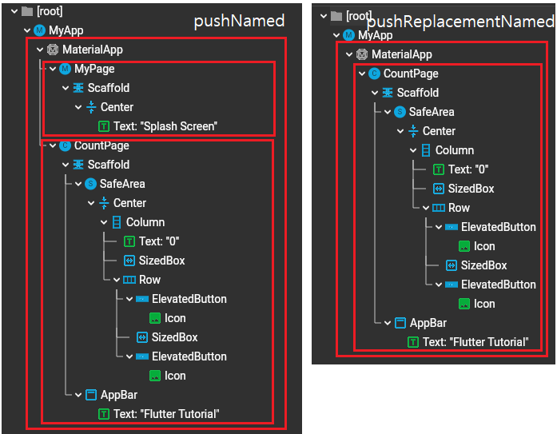

## Screen

## Assignment
- 화면전환 : Navigator.pushReplacementNamed를 사용하여 Named route로 2초 뒤에 화면이 전환.
    + Navigator.pushNamed와 차이점이 무엇인지 파악하기
    
- 버튼 : ElavatedButton을 사용해 숫자를 더하고 빼기
- AppBar : "Flutter Tutorial" 텍스트를 입력하여 center에 위치하도록 변경.
- 버튼 및 텍스트에 적용된 스타일도 같이 적용.
- 그 외: Getx 사용하여 데이터 처리하기
